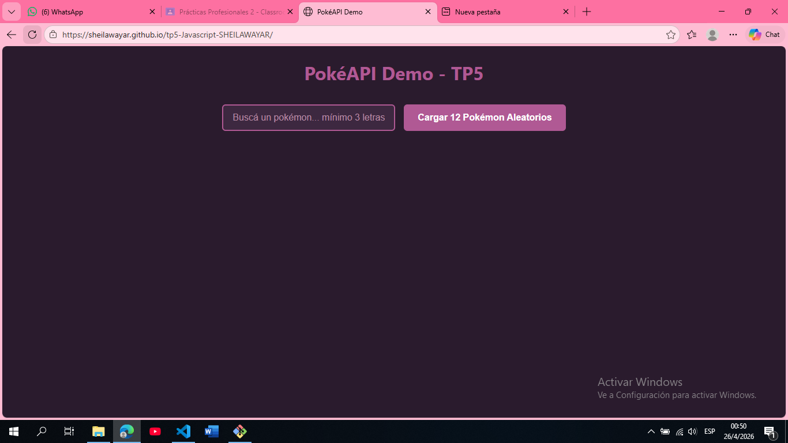
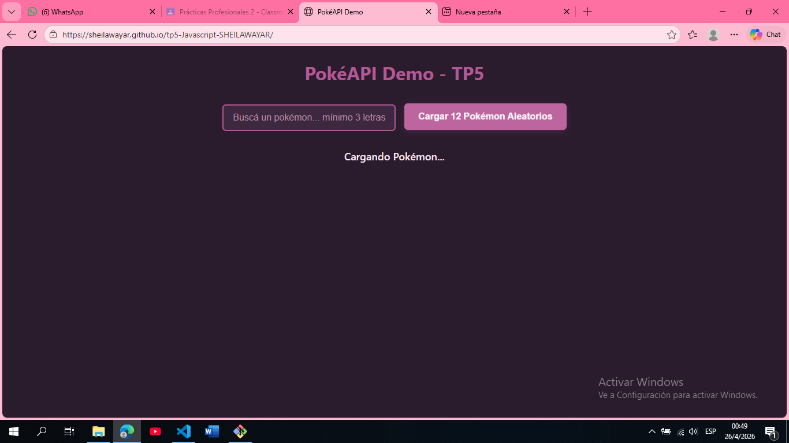
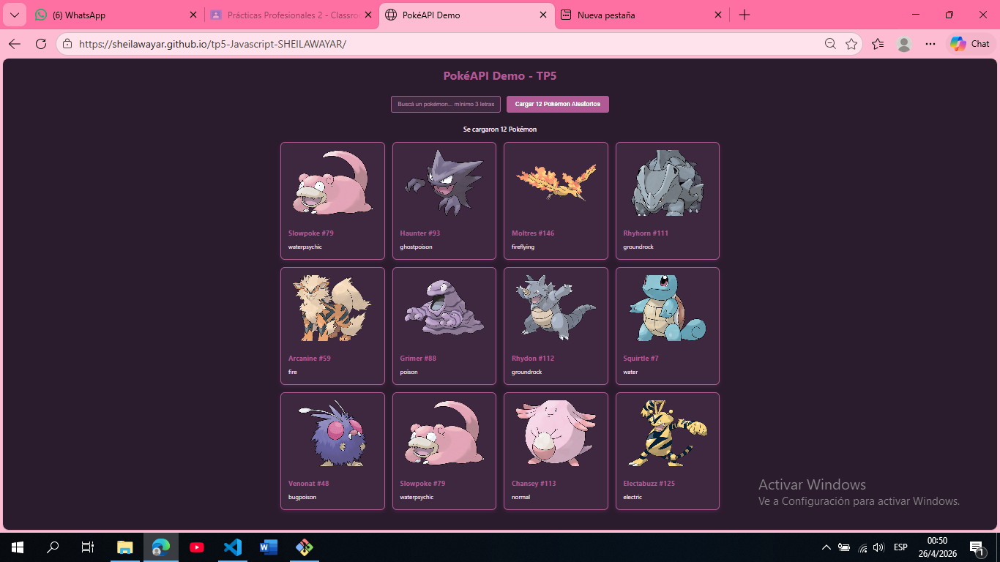
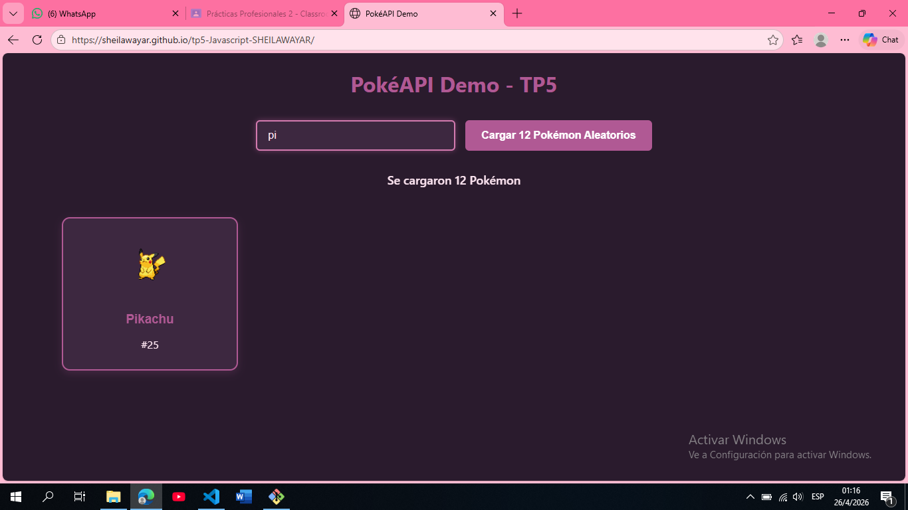
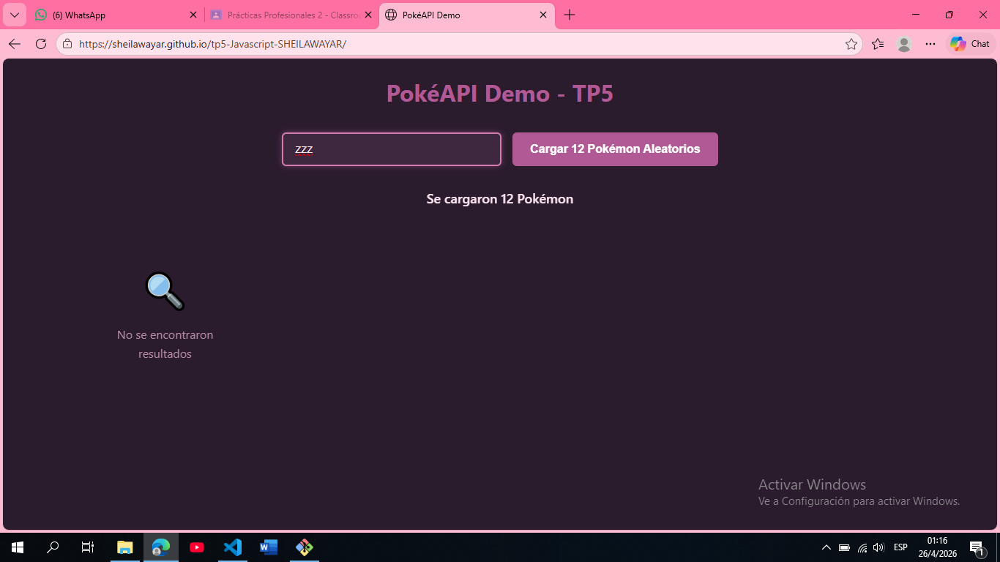

# TP5 JavaScript - SHEILAWAYAR

Proyecto de JavaScript ES6+ con manipulación del DOM, Fetch API y CSS compartido.

## 📋 Páginas del proyecto

### 1. `index.html` - Fundamentos JS
Variables, operadores, condicionales y ciclos básicos.

### 2. `productos.html` - DOM + Eventos
Renderizado dinámico de productos con `.map()`, filtros y eventos de click.

### 3. `todo.html` - Lista de tareas
To-Do App con agregar, marcar como completada y eliminar tareas. Persiste en memoria.

### 4. `api-demo.html` - Fetch API + Buscador
Consume la PokéAPI con `async/await`. Muestra 12 Pokémon aleatorios con manejo de `try/catch`, estados de carga/error y buscador por nombre.

## 🛠️ Tecnologías usadas
- **HTML5** - Estructura semántica
- **CSS3** - Variables, Grid, Flexbox, animaciones
- **JavaScript ES6+** - Arrow functions, async/await, destructuring
- **Fetch API** - Consumo de datos externos
- **PokéAPI** - https://pokeapi.co/api/v2/

## 🎨 Diseño
Paleta coherente basada en `#B05994`. CSS compartido en `css/app.css` con variables, responsive design y estados visuales para carga/error/vacío.

## 🚀 Instrucciones de uso
1. Clonar el repositorio:
```bash
git clone https://github.com/SheilaWayar/tp5-Javascript-SHEILAWAYAR.git
### Capturas de pantalla

**0. Carga Inicio**  


**1. Estado de carga**  


**2. Carga inicial de 12 Pokémon**  


**3. Búsqueda con filter()**  


**4. Estado vacío**  
